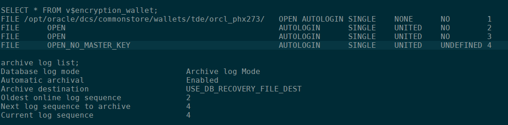

# Zero Downtime Database Migration

## Introduction

This is the second of five labs that are part of the Oracle Public Cloud Database Cloud Service workshop. This lab will introduce you to the [zero downtime migration](https://www.oracle.com/database/technologies/rac/zdm.html) automated solution.  Zero Downtime Migration gives you a way to simplify moving your on-premise databases and Oracle Cloud Infrastructure Classic instances to Oracle Cloud Infrastructure, Exadata Cloud at Customer, and Exadata Cloud Service, without incurring any significant downtime, by leveraging technologies such as Oracle Active Data Guard.

Zero Downtime Migration uses mechanisms such as backing up the source database to Oracle Cloud Infrastructure Object Storage, creating a standby database (with Oracle Data Guard Maximum Performance protection mode and asynchronous (ASYNC) redo transport mode) in the target environment from the backup, synchronizing the source and target databases, and switching over to the target database as the primary database.

  **Note: You must be off your corporate VPN to do the labs.**

**Note:  It will be helpful to have a notepad open as a holding place to copy and paste various items throughout all the labs.** 

To log issues and view the Lab Guide source, go to the [github oracle](https://github.com/oracle/learning-library/tree/master/workshops/dbcs-dba-oci) repository.

## Objectives

-	Confirm source and target database requirements.
-	Download and configure ZDM.
-	Validate your configuration.
-   Migrate the database.
-   Confirm migration results and re-set the source database from standby read only to standalone read write.

## Required Artifacts

-   You must have successfully completed lab 1.

## **Step 1**:  Log into your Oracle Cloud Account, and collect information you will need to complete this lab.

- Navigate to Bare Metal, VM, and Exadata menu item in the Cloud Console.

	

- You will be migrating data from your source database to a target database.  The Target database is a placeholder, and will be replaced by the source database data (ie. if there is anything there it gets wiped out).  Collect the following for both the source and target databases.  You can get the Public IP from the Notes link.


```
Display name:		eg: workshop1_db1
db name:			orcl
db unique name: 	orcl_phx273
Host domain name:	sub01092328510.vcn1.oraclevcn.com
Scan DNS Name:		workshop1-scan.sub01092328510.vcn1.oraclevcn.com
Public IP:		    129.146.162.124
```


```
Display name:		workshop1_db2
db name:			orcl
db unique name: 	orcl_phx3r6
Host domain name:	sub01092328510.vcn1.oraclevcn.com
Scan DNS Name:		workshop1-2-scan.sub01092328510.vcn1.oraclevcn.com
Public IP:		    129.146.123.48 
```

- Log into the source database and confirm archive logging is on (it will be if you created a DBCS OCI instance).
```
ssh -i privateKey opc@129.146.162.124
sudo su - oracle
sqlplus sys/<password> as sysdba
select * from v$encryption_wallet;
exit
```



- Set the master encryption key.  Log into the source database server and rename the existing auto login key out of the way.

```
mv /opt/oracle/dcs/commonstore/wallets/tde/orcl_phx273/cwallet.sso ..
```

- Next enter the following commands.  You will log into the database with sys and create new password and auto login keys.  Use the database system password for everything.
```
sqlplus sys/<password> as sysdba
administer key management set keystore close;

keystore altered.

SELECT wrl_parameter, status, wallet_type FROM v$encryption_wallet;

WRL_PARAMETER
---------------------------------------------------
STATUS			       WALLET_TYPE
------------------------------ --------------------
/opt/oracle/dcs/commonstore/wallets/tde/orcl_phx273/
CLOSED			       UNKNOWN
CLOSED			       UNKNOWN
CLOSED			       UNKNOWN
CLOSED			       UNKNOWN

administer key management set keystore open identified by <password>;
keystore altered.

alter session set container=pdb1;
Session altered.

administer key management set keystore open identified by <password>;
keystore altered.

administer key management set key identified by <password> with backup;
keystore altered.

SELECT wrl_parameter, status, wallet_type FROM v$encryption_wallet;

WRL_PARAMETER
---------------------------------------------------
STATUS			       WALLET_TYPE
------------------------------ --------------------

OPEN			       PASSWORD

alter session set container=cdb$root;
Session altered.

administer key management create auto_login keystore from keystore '/opt/oracle/dcs/commonstore/wallets/tde/orcl_phx273' identified by <password>;
keystore altered.

shutdown immediate;
startup

SELECT * FROM v$encryption_wallet

WRL_TYPE   WRL_PARAMETER					   				        STATUS	WALLET_TYPE	  WALLET_OR KEYSTORE FULLY_BAC	CON_ID
FILE	   	/opt/oracle/dcs/commonstore/wallets/tde/orcl_phx273/    OPEN 	AUTOLOGIN	  SINGLE	 NONE	  NO		     1
FILE								   					            OPEN 	AUTOLOGIN	  SINGLE	 UNITED   NO		     2
FILE								   					            OPEN 	AUTOLOGIN	  SINGLE	 UNITED   NO		     3
```

