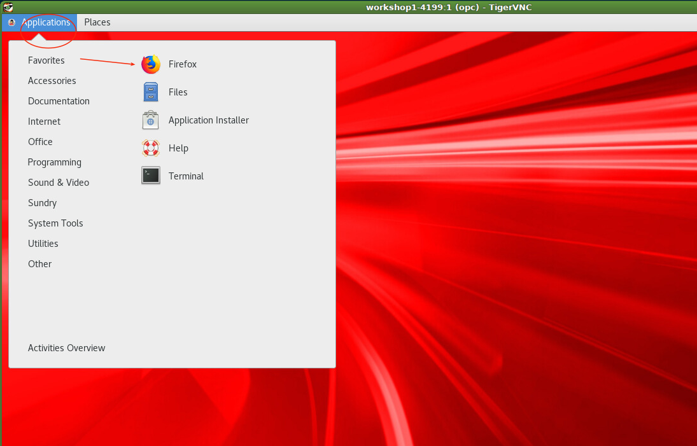

# Zero Downtime Database Migration

## Introduction

This is the second of five labs that are part of the Oracle Public Cloud Database Cloud Service workshop. This lab will introduce you to the [zero downtime migration](https://www.oracle.com/database/technologies/rac/zdm.html) automated solution.  Zero Downtime Migration gives you a way to simplify moving your on-premise databases and Oracle Cloud Infrastructure Classic instances to Oracle Cloud Infrastructure, Exadata Cloud at Customer, and Exadata Cloud Service, without incurring any significant downtime, by leveraging technologies such as Oracle Active Data Guard.

Zero Downtime Migration uses mechanisms such as backing up the source database to Oracle Cloud Infrastructure Object Storage, creating a standby database (with Oracle Data Guard Maximum Performance protection mode and asynchronous (ASYNC) redo transport mode) in the target environment from the backup, synchronizing the source and target databases, and switching over to the target database as the primary database.

  **Note: You must be off your corporate VPN to do the labs.**

**Note:  It will be helpful to have a notepad open as a holding place to copy and paste various items throughout all the labs.** 

To log issues and view the Lab Guide source, go to the [github oracle](https://github.com/oracle/learning-library/tree/master/workshops/dbcs-dba-oci) repository.

## Objectives

-	Confirm source and target database requirements.
-	Download and configure ZDM.
-	Validate your configuration.
-   Migrate the database.
-   Confirm migration results and re-set the source database from standby read only to standalone read write.

## Required Artifacts

-   You must have successfully completed lab 1.

## **Step 1**:  Log into your Oracle Cloud Account, and collect information you will need to complete this lab.

- Navigate to Bare Metal, VM, and Exadata menu item in the Cloud Console.

	

- You will be migrating data from your source database to a target database.  The Target database is a placeholder, and will be replaced by the source database data (ie. if there is anything there it gets wiped out).  Collect the following for both the source and target databases.  You can get the Public IP from the Notes link.


```
Display name:		eg: workshop1_db1
db name:			orcl
db unique name: 	orcl_phx273
Host domain name:	sub01092328510.vcn1.oraclevcn.com
Scan DNS Name:		workshop1-scan.sub01092328510.vcn1.oraclevcn.com
Public IP:		    129.146.162.124
```


```
Display name:		workshop1_db2
db name:			orcl
db unique name: 	orcl_phx3r6
Host domain name:	sub01092328510.vcn1.oraclevcn.com
Scan DNS Name:		workshop1-2-scan.sub01092328510.vcn1.oraclevcn.com
Public IP:		    129.146.123.48 
```

- Log into the source database and confirm archive logging is on (it will be if you created a DBCS OCI instance).
```
ssh -i privateKey opc@129.146.162.124
sudo su - oracle
sqlplus sys/<password> as sysdba
select * from v$encryption_wallet;
exit
```


- Set the master encryption key.  Log into the source database server and rename the existing auto login key out of the way.

```
mv /opt/oracle/dcs/commonstore/wallets/tde/orcl_phx273/cwallet.sso ..
```

- Next enter the following commands.  You will log into the database with sys and create new password and auto login keys.  Use the database system password for everything.
```
sqlplus sys/<password> as sysdba
administer key management set keystore close;

keystore altered.

SELECT wrl_parameter, status, wallet_type FROM v$encryption_wallet;

WRL_PARAMETER
---------------------------------------------------
STATUS			       WALLET_TYPE
------------------------------ --------------------
/opt/oracle/dcs/commonstore/wallets/tde/orcl_phx273/
CLOSED			       UNKNOWN
CLOSED			       UNKNOWN
CLOSED			       UNKNOWN
CLOSED			       UNKNOWN

administer key management set keystore open identified by <password>;
keystore altered.

alter session set container=pdb1;
Session altered.

administer key management set keystore open identified by <password>;
keystore altered.

administer key management set key identified by <password> with backup;
keystore altered.

SELECT wrl_parameter, status, wallet_type FROM v$encryption_wallet;

WRL_PARAMETER
---------------------------------------------------
STATUS			       WALLET_TYPE
------------------------------ --------------------

OPEN			       PASSWORD

alter session set container=cdb$root;
Session altered.

administer key management create auto_login keystore from keystore '/opt/oracle/dcs/commonstore/wallets/tde/orcl_phx273' identified by <password>;
keystore altered.

shutdown immediate;
startup

SELECT * FROM v$encryption_wallet

WRL_TYPE   WRL_PARAMETER					   				        STATUS	WALLET_TYPE	  WALLET_OR KEYSTORE FULLY_BAC	CON_ID
FILE	   	/opt/oracle/dcs/commonstore/wallets/tde/orcl_phx273/    OPEN 	AUTOLOGIN	  SINGLE	 NONE	  NO		     1
FILE								   					            OPEN 	AUTOLOGIN	  SINGLE	 UNITED   NO		     2
FILE								   					            OPEN 	AUTOLOGIN	  SINGLE	 UNITED   NO		     3
```

- SSH into the compute instance now to prepare for and install the ZDM software.  Start by opening port 5901 and installing `expect`.
```
sudo firewall-cmd --state
running
sudo firewall-cmd --permanent --zone=public --add-port=5901/tcp
success
sudo firewall-cmd --reload
success
sudo yum install expect
```

- Create group zdm and add user oracle to that group.  Then create directores /u01/app and make oracle the owner of those directories.
```
sudo groupadd zdm
sudo usermod -a -G zdm oracle
sudo mkdir -p /u01/app
sudo chown oracle /u01/app
sudo chgrp oinstall /u01/app
```

- Start your local vnc viewer and log into the 


- Start firefox and download the software from [this](https://www.oracle.com/database/technologies/rac/zdm-downloads.html) location.




- Now that you have downloaded the software everything else is done in a terminal shell.  You can either continue working in your VNC session for this or close VNC and just ssh into the image.  Next you will mv the zip file to the /u01/app folder, unzip the file, switch to the user oracle, create the zdm homes, and then kick off the zdm install.  
```
sudo mv /home/opc/Downloads/zdm19.zip /u01/app
sudo chown oracle /u01/app/zdm19.zip
sudo chgrp oinstall /u01/app/zdm19.zip
sudo su - oracle
cd /u01/app
unzip zdm19.zip
mkdir -p zdmhome
mkdir -p zdmbase
./zdminstall.sh setup oraclehome=/u01/app/zdmhome oraclebase=zdmbase ziploc=zdm_home.zip -zdm
```

- Verify the install succeeded.
```
zdmhome/bin/zdmcli query image
workshop1-4199.sub01092328510.vcn1.oraclevcn.com: Audit ID: 3
No image has been configured
```

- Start the zdm service.
```
zdmhome/bin/zdmservice start
No instance detected, starting zdmservice

[jwcctl debug] Environment ready to start JWC
[jwcctl debug] Return code of initialization: [0]

[jwcctl debug] ... BEGIN_DEBUG [Action= start] ...
Start JWC
[jwcctl debug] Loading configuration file: /u01/app/zdmbase/crsdata/workshop1-4199/rhp/conf/jwc.properties
[jwcctl debug]     oracle.jmx.login.credstore = CRSCRED
[jwcctl debug]     oracle.jmx.login.args = DOMAIN=rhp
[jwcctl debug]     oracle.rmi.url = service:jmx:rmi://{0}:{1,number,#}/jndi/rmi://{0}:{1,number,#}/jmxrmi
[jwcctl debug]     oracle.http.url = http://{0}:{1,number,#}/rhp/gridhome
[jwcctl debug]     oracle.jwc.tls.clientauth = false
[jwcctl debug]     oracle.jwc.tls.rmi.clientfactory = RELOADABLE
[jwcctl debug]     oracle.jwc.lifecycle.start.log.fileName = JWCStartEvent.log
[jwcctl debug] Get JWC PIDs
[jwcctl debug] Done Getting JWC PIDs
[jwcctl debug] ... JWC containers not found ...
[jwcctl debug]     Start command:-server -Xms128M -Xmx384M -Djava.awt.headless=true -Ddisable.checkForUpdate=true -Djava.util.logging.config.file=/u01/app/zdmbase/crsdata/workshop1-4199/rhp/conf/logging.properties -Djava.util.logging.manager=org.apache.juli.ClassLoaderLogManager -DTRACING.ENABLED=true -DTRACING.LEVEL=2 -Doracle.wlm.dbwlmlogger.logging.level=FINEST -Duse_scan_IP=true -Djava.rmi.server.hostname=workshop1-4199 -Doracle.http.port=8896 -Doracle.jmx.port=8895 -Doracle.tls.enabled=false -Doracle.jwc.tls.http.enabled=false -Doracle.rhp.storagebase=/u01/app/zdmbase -Djava.security.egd=file:/dev/urandom -Doracle.jwc.wallet.path=/u01/app/zdmbase/crsdata/workshop1-4199/security -Doracle.jmx.login.credstore=WALLET -Dcatalina.home=/u01/app/zdmhome/tomcat -Dcatalina.base=/u01/app/zdmbase/crsdata/workshop1-4199/rhp -Djava.io.tmpdir=/u01/app/zdmbase/crsdata/workshop1-4199/rhp/temp -Doracle.home=/u01/app/zdmhome -Doracle.jwc.mode=STANDALONE -classpath /u01/app/zdmhome/jlib/cryptoj.jar:/u01/app/zdmhome/jlib/oraclepki.jar:/u01/app/zdmhome/jlib/osdt_core.jar:/u01/app/zdmhome/jlib/osdt_cert.jar:/u01/app/zdmhome/tomcat/lib/tomcat-juli.jar:/u01/app/zdmhome/tomcat/lib/bootstrap.jar:/u01/app/zdmhome/jlib/jwc-logging.jar org.apache.catalina.startup.Bootstrap start
[jwcctl debug] Get JWC PIDs
[jwcctl debug] Done Getting JWC PIDs
[jwcctl debug] ... JWC Container (pid=2496) ...
[jwcctl debug] ... JWC Container running (pid=2496) ...
[jwcctl debug]     Check command:-Djava.net.preferIPv6Addresses=true -Dcatalina.base=/u01/app/zdmbase/crsdata/workshop1-4199/rhp -Doracle.wlm.dbwlmlogger.logging.level=FINEST -Doracle.jwc.client.logger.file.name=/u01/app/zdmbase/crsdata/workshop1-4199/rhp/logs/jwc_checker_stdout_err_%g.log -Doracle.jwc.client.logger.file.number=10 -Doracle.jwc.client.logger.file.size=1048576 -Doracle.jwc.wallet.path=/u01/app/zdmbase/crsdata/workshop1-4199/security -Doracle.jmx.login.credstore=WALLET -Doracle.tls.enabled=false -Doracle.jwc.tls.http.enabled=false -classpath /u01/app/zdmhome/jlib/jwc-logging.jar:/u01/app/zdmhome/jlib/jwc-security.jar:/u01/app/zdmhome/jlib/jwc-client.jar:/u01/app/zdmhome/jlib/jwc-cred.jar:/u01/app/zdmhome/jlib/srvm.jar:/u01/app/zdmhome/jlib/srvmhas.jar:/u01/app/zdmhome/jlib/cryptoj.jar:/u01/app/zdmhome/jlib/oraclepki.jar:/u01/app/zdmhome/jlib/osdt_core.jar:/u01/app/zdmhome/jlib/osdt_cert.jar:/u01/app/zdmhome/tomcat/lib/tomcat-juli.jar oracle.cluster.jwc.tomcat.client.JWCChecker localhost 8896 -1
[jwcctl debug] ... JWC Container is ready ...
[jwcctl debug] ... START - Return code = 0 ...
[jwcctl debug]  ... END_DEBUG [Action=start] ...
[jwcctl debug] Return code of AGENT: [0]

Return code is 0
Server started successfully.
```

- Retrieve server status.
```
zdmhome/bin/zdmservice status

---------------------------------------
	Service Status
---------------------------------------

 Running: 	true
 Tranferport: 	5000-7000
 Conn String: 	jdbc:derby:/u01/app/zdmbase/derbyRepo;create=true
 Repo Path: 	/u01/app/zdmbase/derbyRepo
 RMI port: 	8895
 HTTP port: 	8896
 Wallet path: 	/u01/app/zdmbase/crsdata/workshop1-4199/security
 ```

 - Edit the response file `zdmhome/rhp/zdm/template/zdm_template.rsp` and update the following fields.  Ignore all others.
 ```
TGT_DB_UNIQUE_NAME=orcl_phx3r6 -- update with your db name
MIGRATION_METHOD=DG_OSS
PLATFORM_TYPE=VMDB       
TGT_DATADG=+DATA
TGT_REDODG=+RECO
TGT_RECODG=+RECO
HOST=https://swiftobjectstorage.us-phoenix-1.oraclecloud.com/v1/orasenatdpltintegration02 -- update with your tenancy (in this case orasenatdpltintegration02) and region (in this case phoenix)
OPC_CONTAINER=zdm -- update with your object storage bucket (in lab 1 you created zdm)
NONCDBTOPDB_CONVERSION=FALSE
SKIP_FALLBACK=TRUE
SHUTDOWN_SRC=FALSE
SRC_RMAN_CHANNELS=6
```

- Update the `/etc/hosts` file and enter the IP addresses and scan IPs of the source and target databases.  You collected this information in the beginning of this lab.  Your values will be different that those below.
```
exit -- exiting from oracle to opc
sudo vim /etc/hosts -- edit the /etc/hosts file and add the following
129.146.162.124	    workshop1-scan.sub01092328510.vcn1.oraclevcn.com workshop1-scan
129.146.123.48		workshop1-2-scan.sub01092328510.vcn1.oraclevcn.com workshop1-2-scan
```


