# DBCS Maintenance

## Introduction

While the Oracle Cloud has greatly simplified DBA tasks, the DBA still has a role to play in the development and maintenance of DBCA instances.  This is the fourth of five labs that will perform some common dba activities such as scaling an instance, updating security access, and recoving a dropped table.

This lab supports the following use cases:
- Rapid creation and scaling of cloud databases.
- Maintenance of security access.
- Recovery of data.

To log issues and view the Lab Guide source, go to the [github oracle](https://github.com/oracle/learning-library/tree/master/workshops/dbcs-dba-oci) repository.

## Objectives

- Maintain security access.
- Scale up an instance.
- Add a SSH Key.
- Recover a dropped table.

## Required Artifacts

- The following lab does not require set up or artifacts from the previous labs.

## **STEP 1**: Create Security Rule

Once you have a running database you may wish to open (or close) various ports.  We will create a new rule to open 1522 (not used..this is just an example).  Note: if you ran the step steps for this workshop (rather than someone else on your behalf) these steps are the same that were done to open vnc port 5901, and you can skip this activity/task.

- Open a browser on the WorkshopImage desktop and log into the cloud console.  Select Database (OCI).

	
 
	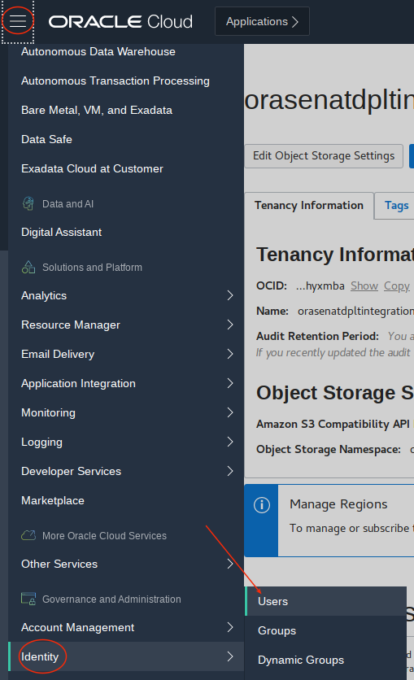

- In the top menu select Networking - Virtual Cloud Networks.

	

- Ensure you have the appropriate Compartment (Demo in this case).

	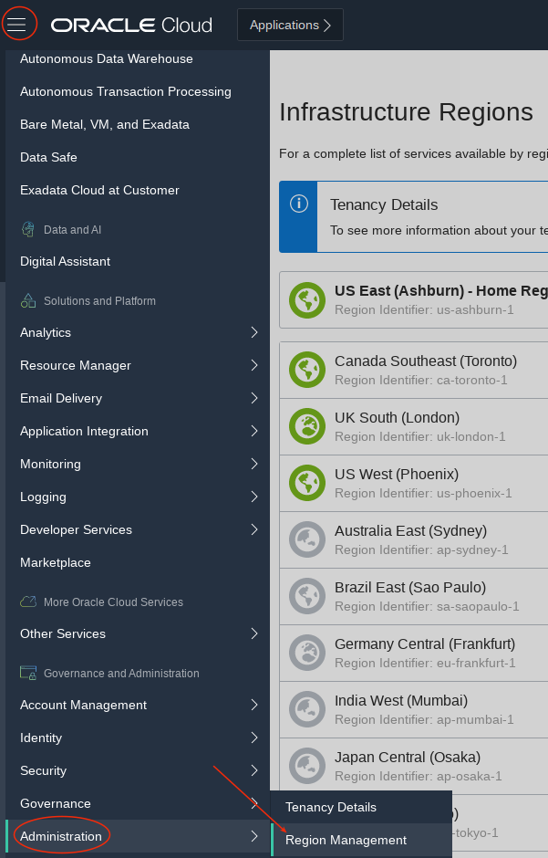

- In Lab 100 you would have created a VCN already, and there should also be one from the setup steps.  Select either one.

	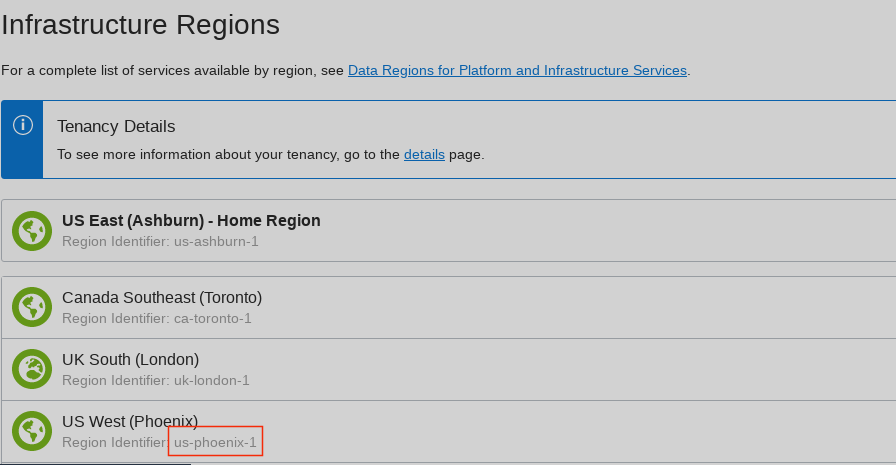

- Select Security Lists on the left, and then select the Default Security List.

	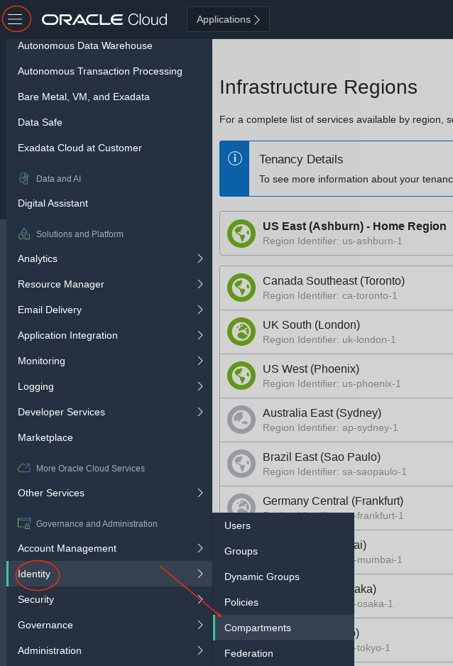

	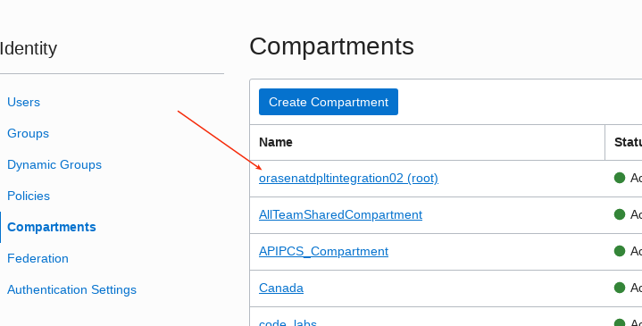

- Select Edit All Rules.

	

- Scroll down and click on `Add Rule`.  Then enter a new 1522 rule.

	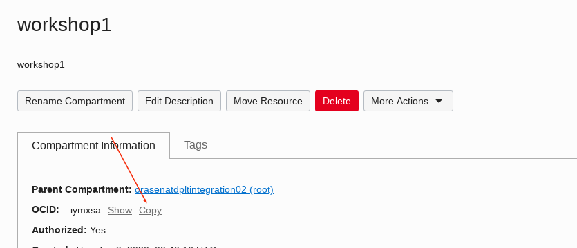

- Scroll down further to `Save Security List Rules`.  The rule only takes a few seconds to become active.

	

	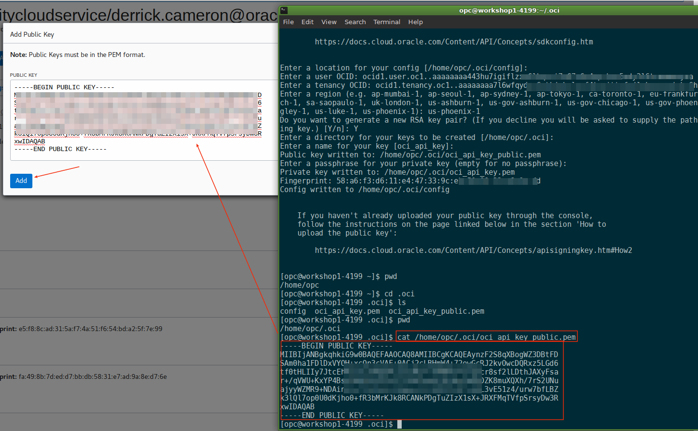

Databases typically grow and require additional storage and possibly compute resources.  This shows the elastic nature of the Oracle Cloud.

## **STEP 2**: Scale Up An Instance

- Navigate back to the DB Systems screen and select the Alpha01A-DBCS instance.

	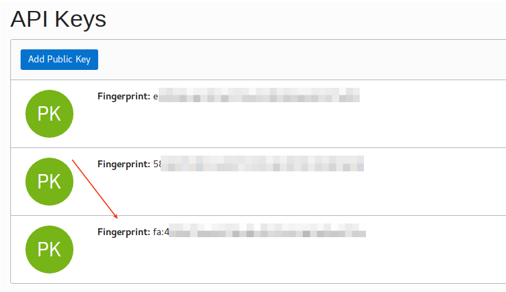

- Select `Scale Storage Up`.

	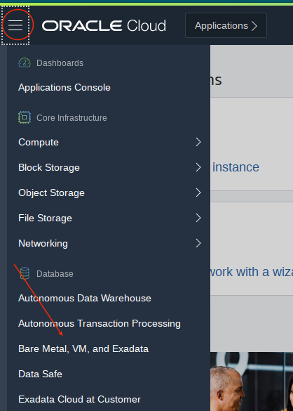

- We can scale the storage to 32 Terebytes.  In this case we will add an additional 256G storage.

	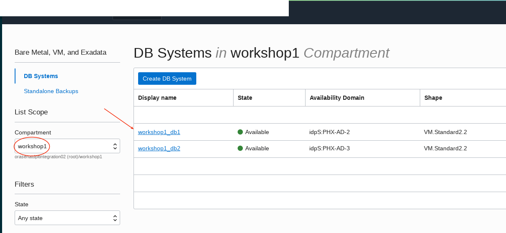

	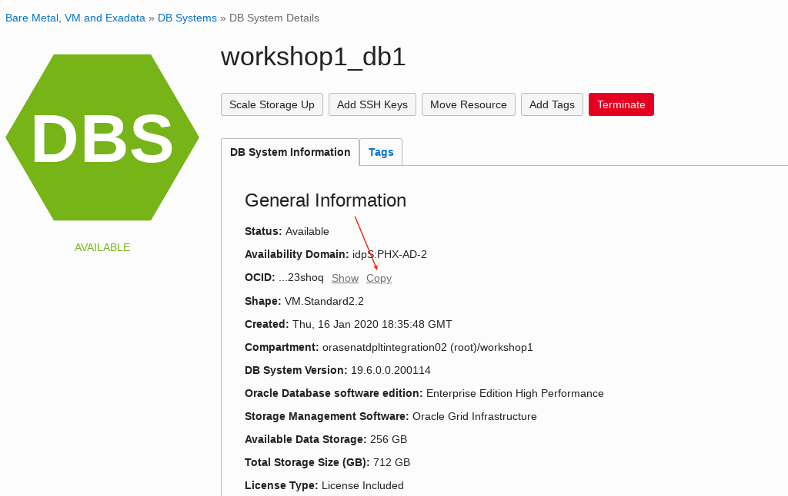

- Note the instance will go into Service Maintenance mode and show `Updating` while the scale operation is processing.  This will only take a few minutes.

	

- After a few minutes refresh the screen - you should see the storage change from 256GB to 512GB.

 	

SSHs are required when creating a new DBCS instance.  Later you can add additional keys (eg: if you lost your existing private key) through the database console.

## **STEP 3**: Generate New Key Pair and add a SSH key.

- Navigate to the compute desktop and open a new terminal window.  Enter the following.
	- `ssh-keygen`
    - **Enter filename:** `lab300`
    - **Then hit enter twice for no password**

 	

- Change private key permissons.  Enter the following.
```
ls
chmod 600 lab300
```


- Add SSH key.  Navigate back to the DB Systems page, select Alpha01A-DBCS, and select `Add SSH Keys`.

 	

	

- In a terminal window enter the flowing.
```
cat lab200.pub
```


- Select the key text (carefully) and right click to select copy (or use the menu - right click more likely to work).

	

- Paste the key into the `Add SSH Keys` window.

	

- The instance will briefly go into Service Mainenance Mode and then in a few seconds after you refresh the screen you will see the instance back in normal operation.

## **STEP 4**: Confirm Access

- Confirm access.  Go back to your terminal window and SSH to the image using the new key.  Enter the following.
```
ssh -i lab300 opc@<Alpha01A-DBCS IP>
exit
```


## **STEP 6**: Configure RMAN for Cloud Backup.

- Configure Object Storage.  Select `Storage` - `Object Storage` in the menu.

 	

- Create a new Bucket called `alpha` in the Demo Compartment (or the Compartment you have been assigned).  

 	

 	

## **STEP 7**:  Back up the Database

- Log into RMAN and backup the database.  We will leave the RMAN default values.  Enter the following.
```
rman target /
show all;
set encryption on;
alter system archive log current;
backup database plus archivelog;
```


- List/confirm backup and create restore point.  Enter the following
```
list backup summary;
create restore point gold preserve;
```


## **STEP 8**:  Drop a Table 'Accidently'

- Exit from RMAN and log into alpha and drop table .  Enter the following.
```
exit;
sqlplus alpha/ALpha2018__@pdb1;
select table_name from user_tables;
drop table order_items;
exit;
```


## **STEP 9**:  Recover the Database.

- Restart the Database in mount mode and open the password key.
```
sqlplus sys/ALpha2018__ as sysdba
shutdown immediate;
startup mount;
administer key management set keystore open identified by ALpha2018__ container=all;
exit;
```


- Log into RMAN and restore the database.
```
rman target /
set decryption identified by ALpha2018__;
run {restore database; recover database to restore point gold; alter database open resetlogs;}
exit;
```


## **STEP 10**:  Confirm Data Recovery

- Log into sys and open pluggable databases and password wallet.
```
sqlplus sys/ALpha2018__ as sysdba;
alter pluggable database all open;
alter session set container=pdb1;
administer key management set keystore open force keystore identified by ALpha2018__;
```


- Connect as alpha and confirm order_items table is restored.
```
connect alpha/ALpha2018__@pdb1;
select count(*) from order_items;
exit;
```


