# Using the Oracle Command Line Interface (CLI) to manage DBCS Instances

## Introduction

In this Lab you will use the Oracle Command Line Interface (CLI) to retrieve information about the configuration and status of various cloud services without the need to use the Cloud Console.  Note you may wish to open a separate text window with your identity domain account and password to copy/paste these into the placeholders in the following commands, and then copy this into the terminal windows.

This lab supports the following use cases:
-	Use of Oracle's API to manage cloud databases.

To log issues and view the Lab Guide source, go to the [github oracle](https://github.com/oracle/learning-library/tree/master/workshops/dbcs-dba-oci) repository.

## Objectives

- Install Oracle CLI
- Use OCI commands to request information about DBCS related configuration and services.
- Create services with oci commands.

## Required Artifacts

-   There are no dependencies for this lab.

## Create an Object Store Bucket and Install Oracle CLI.

### **STEP 1**:  Create an Object Store Bucket. Note you may have done this as part of the setup or part of lab 300.  If so you can skip this step. 

- To create an object store bucket go to the cloud console and select Database (OCI).

  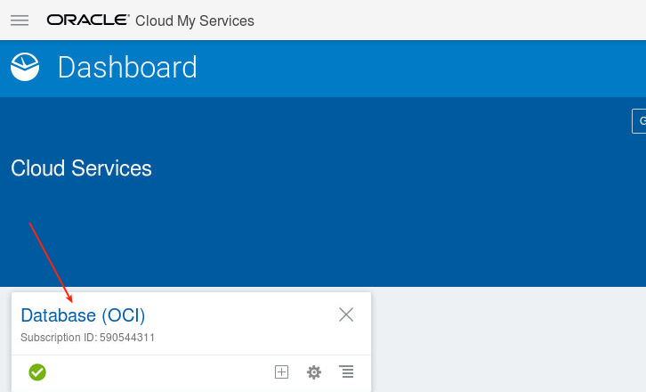

  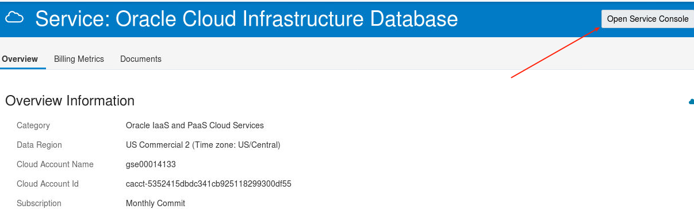

- Select Storage - Object Storage and select the Demo Compartment (or your working compartment).

  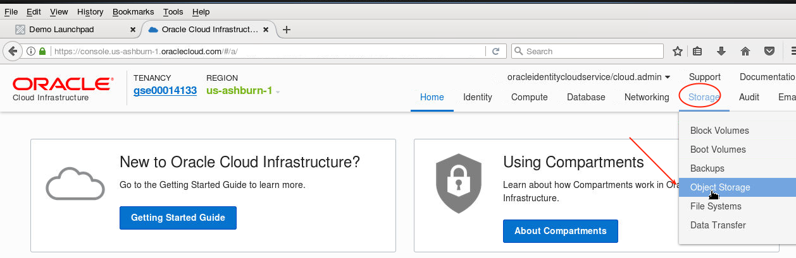

  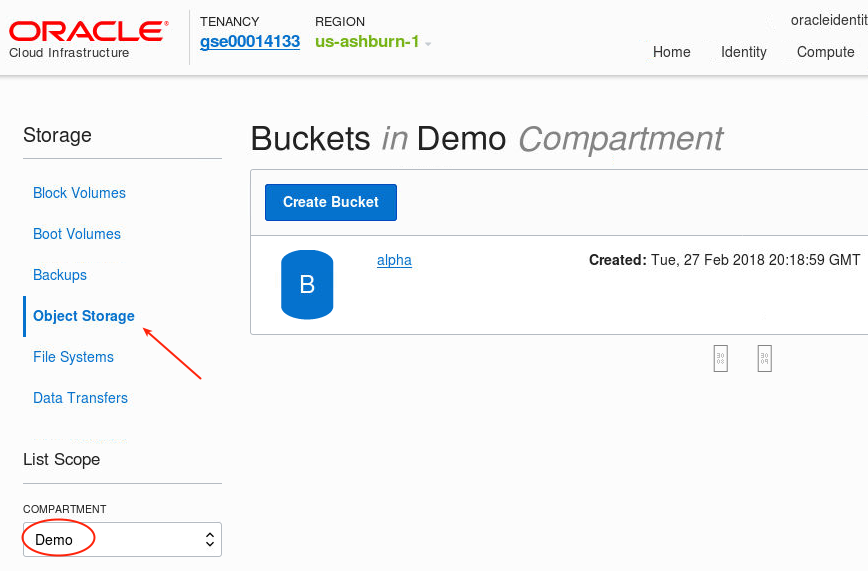

- Select `Create Bucket`.

  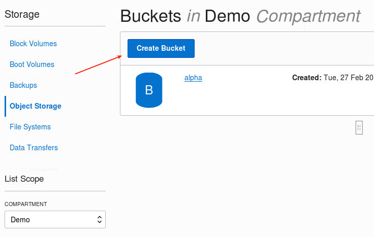

- Call the Bucket `alpha`.  Accept the defaults.

  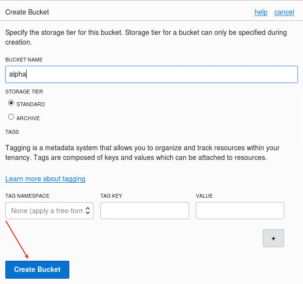

We will use the bucket later.

### **STEP 2**:  Collect Keys for use by the Oracle CLI in Step 3

- The following keys will be needed.  If you configured and ran Terraform as part of the setup to this workshop you will already have these keys in the Terraform configuration (file env_vars.bat) on your desktop.  If someone else ran the setup on your behalf (or as part of the setup by an instructor) proceed with the following steps to obtain the keys.  Open a notepad and save these for the configuration in step 3:
  - `tenancy` (select tenancy and then copy OCID)

  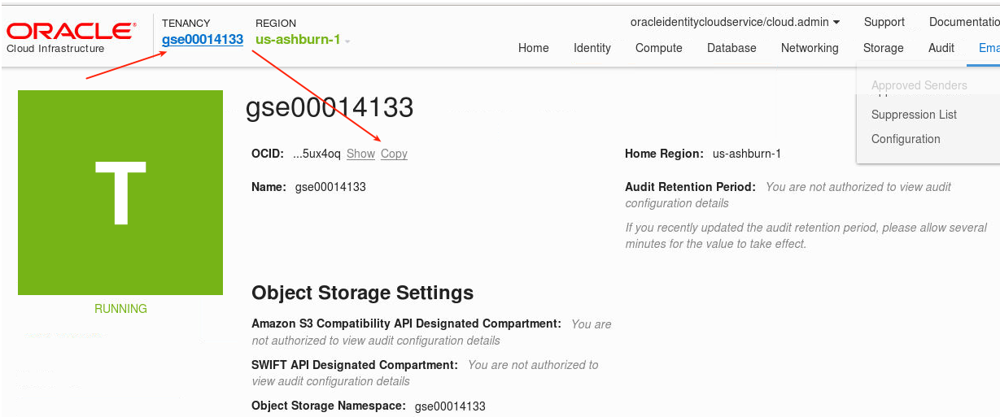

  - `region`

  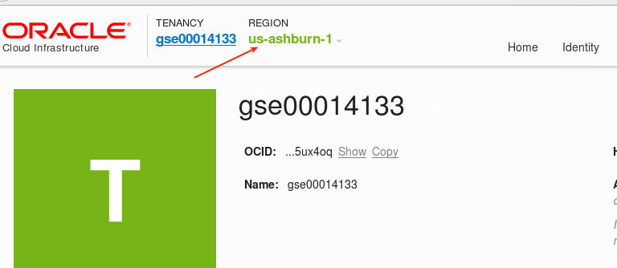

  - `compartment`

  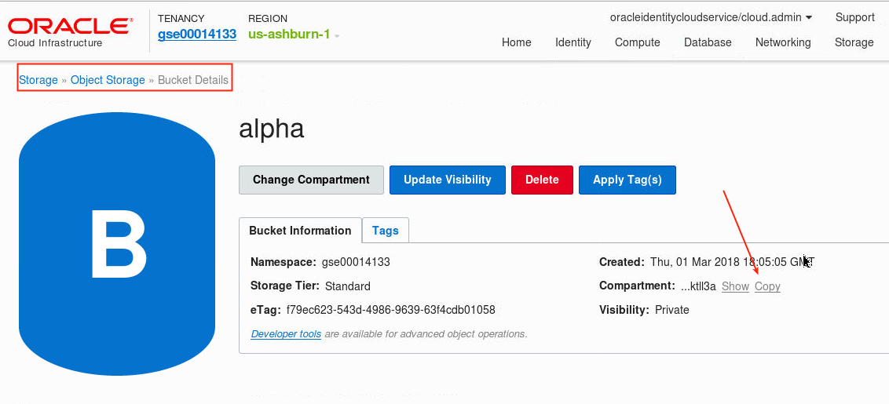

  - `user`

  - `fingerprint `


### **STEP 3**:  Install Oracle CLI

- **We need to use the opc user for the following steps**.  Open a terminal window and enter the following.  
```
ssh -i /tmp/ws/privateKey opc@localhost (log into the WorkshopImage as opc)

sudo yum -y install gcc libffi-devel python-devel openssl-devel (enter Y to all prompts)

sudo yum clean all
```


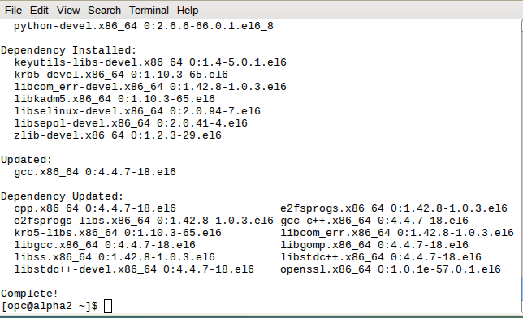

- Now install the CLI.  Enter the following.  This will take a few minutes.
```
bash -c "$(curl -L https://raw.githubusercontent.com/oracle/oci-cli/master/scripts/install/install.sh)" (accept the defaults (Y))
```
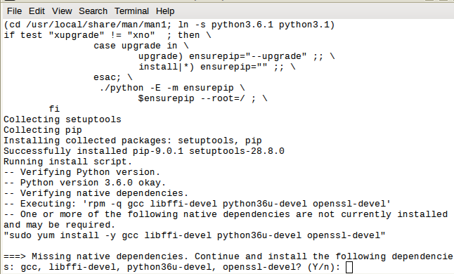

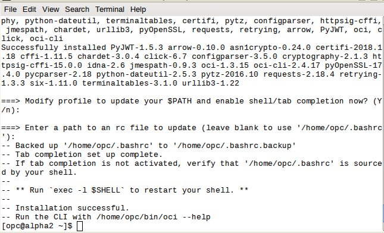

- Set the locale:
```
export LC_ALL=en_US.utf8
```
- Configure CLI.  Enter the following:
```
oci setup config (take the defaults)
```
  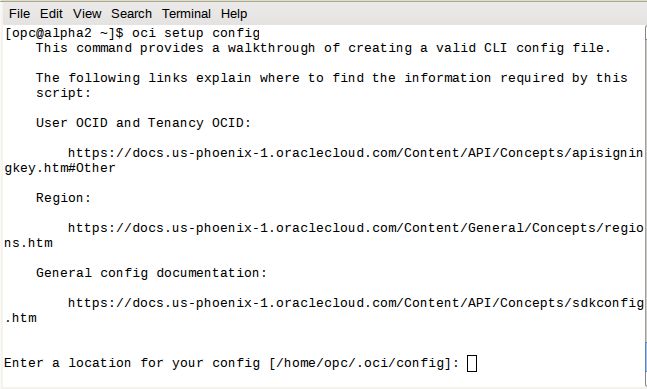

- Respond to prompts with the OCIDs you copied in the previous step.  Accept Y to generate a new RSA key pair and accept location defaults.

  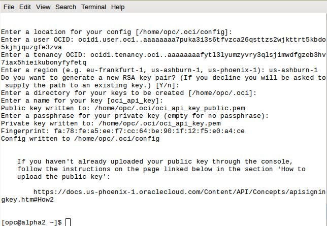

### **STEP 4**:  Upload the Public Key

- We need to upload the public key.  Go to Identity - Users.  Then click on the `api.user` user, and then click on `Add Public Key`.

  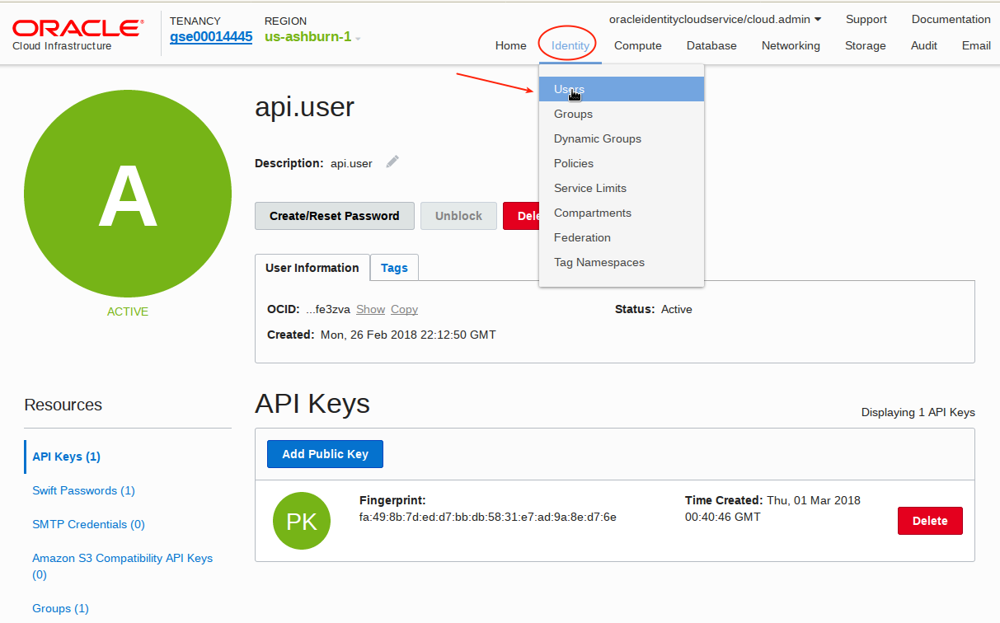

  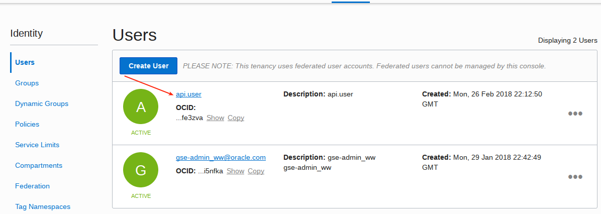

  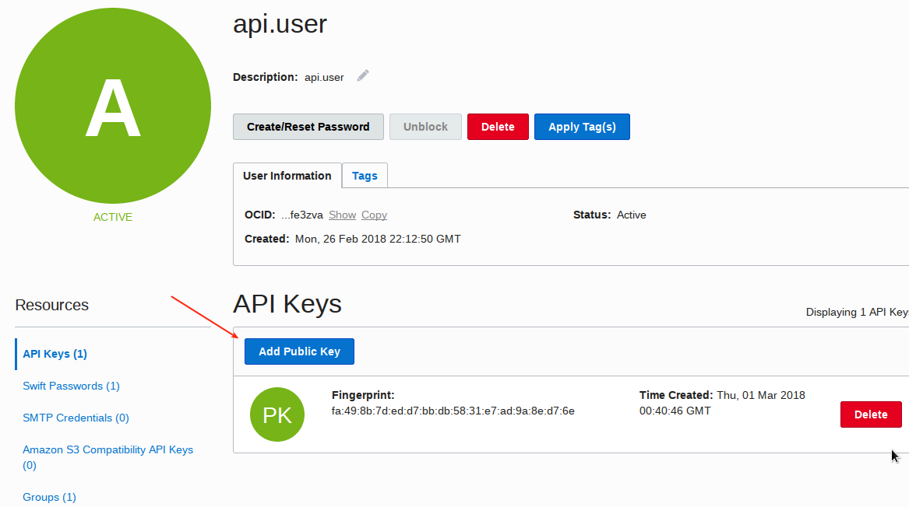

- While the Add Public Key is open enter the following in the terminal window.  We will paste the key contents into this open window, which is still logged in as opc through a SSH session.
```
cat /home/opc/.oci/oci_api_key_public.pem
```
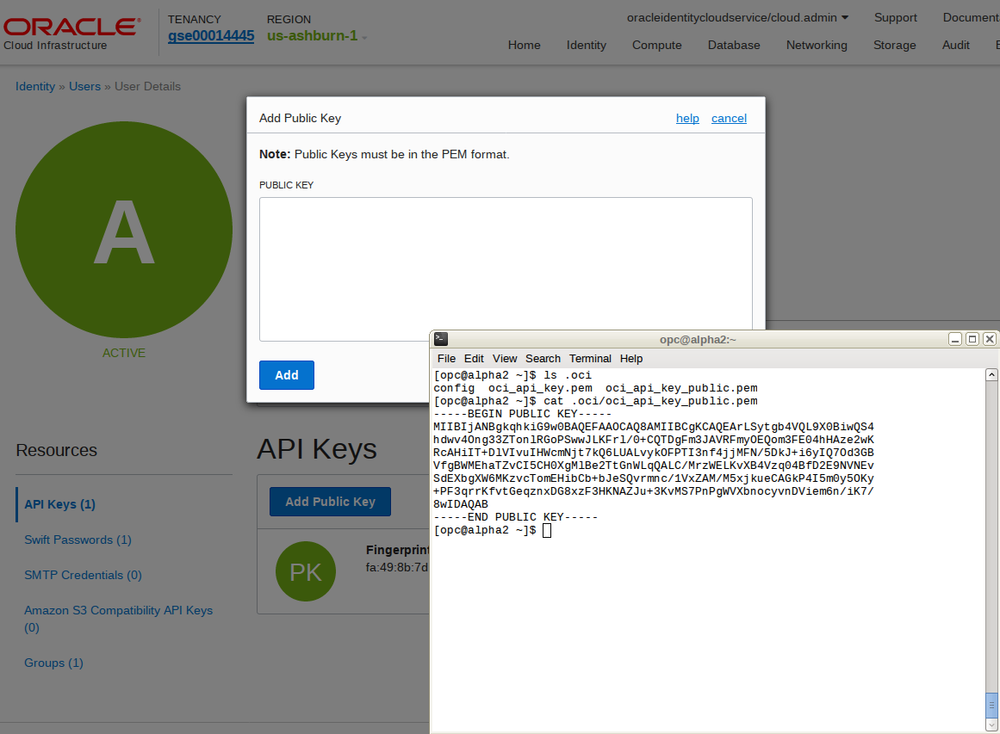

- Highlight the key and right click to copy.  Then paste into the key window.

  

  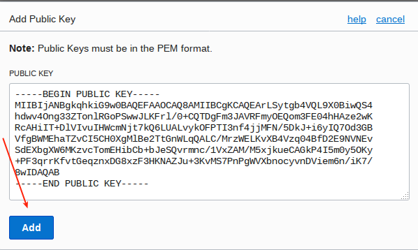

- Copy the fingerprint to your notepad.  We'll use this later. 

  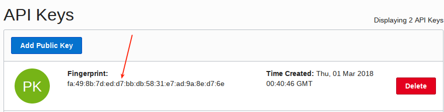

## Example CLI Requests

### **STEP 5**: Retrieve Cloud Environment Objects

-	List regions.  Enter the following in a command window.  Note, if you closed out of the previous session and need to start a NEW terminal window, you will need to ssh back into opc (`ssh -i /tmp/ws/privateKey opc@localhost`), and then set your language variable (`export LC_ALL=en_US.utf8`).
```
oci iam region list --output table
```
  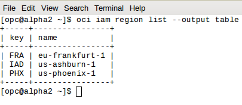

-	List compute images.  Substitute your compartment-id in the <compartment-id> placeholder.
```
oci compute image list -c <compartment-id> --output table --query "data [*].{ImageName:\"display-name\", OCID:id}"
```
  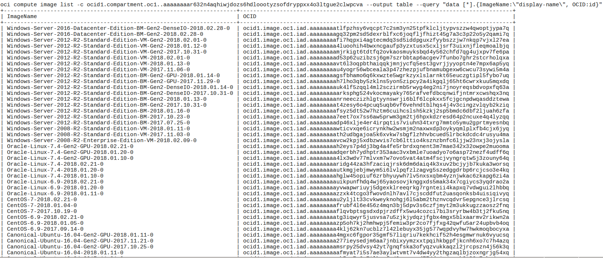

### **STEP 6**: Retrieve Database Related Information and Create a New VCN

- When installing the CLI tool a config file was generated and you enter some information in the prompts.  This information can be entered in the command line as parameters, but this can become lengthy.  Note that the install created a `.oci` (hidden) directory in the user's home directory.  Review the contents - enter the following. We will be make more CLI requests that will have additional parameters.  These parameters can be added to the config file to save typing in the future.
```
ls -l .oci
cat .oci/config
```


- Besides reading the CLI reference documentation, an additional tip is to use the -h (or --help) parameter.  To see this enter the following:
```
oci db database -h (scroll down, and then hit q to exit)
oci db database list -h (enter q to quit)
```


- To list databases (within database services) we'll need the db-system-id.  Go to the cloud console to get that.  Select the Alpha01A-DBCS system, and then select the OCID:

  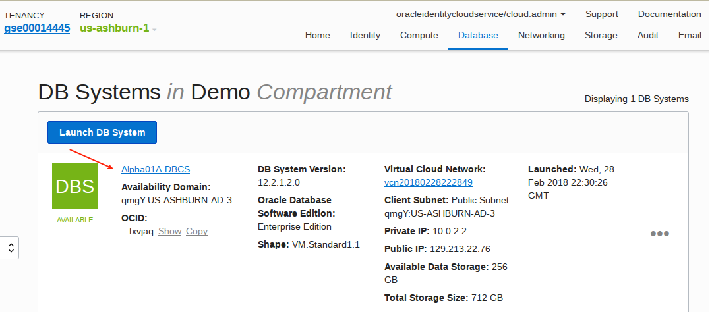

  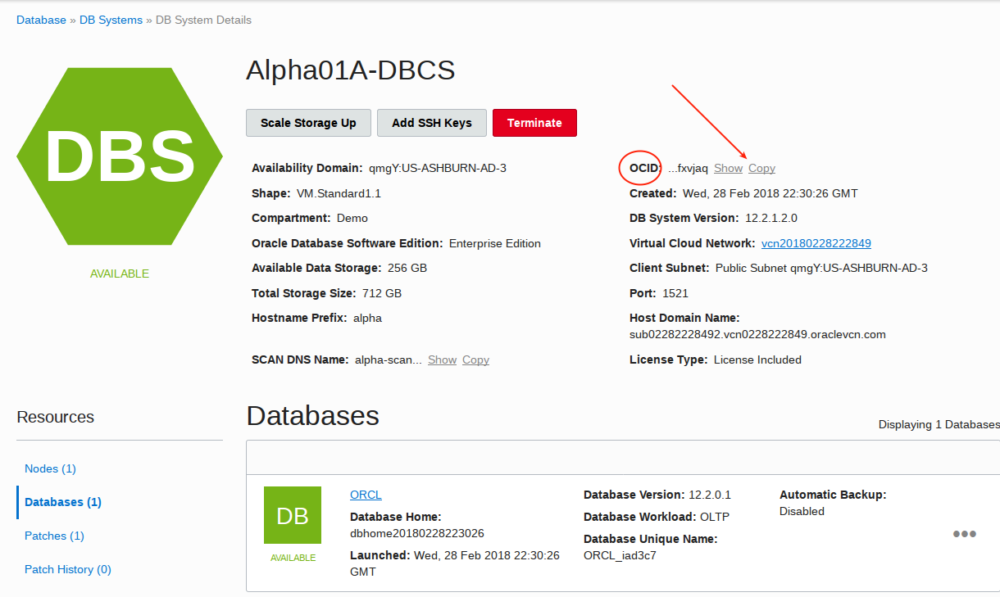

- Then go back to the terminal window and enter the following:
```
oci db database list --compartment-id <copy your compartment-id from above> --db-system-id <paste the OCID here>
```
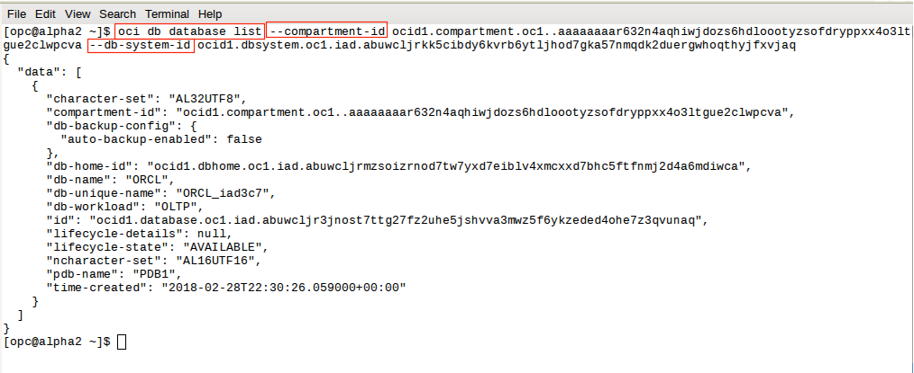

- List Virtual Cloud Networks. 
```
oci network vcn list -c <copy your compartment-id here> (note that -c is a shortcut for --compartment-id)
```
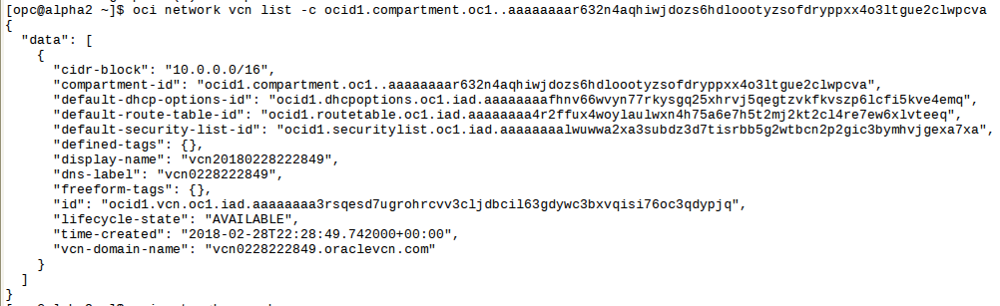

- Create a new VCN.  First review our current VCN (menu Network - Virtual Cloud Network).
```
oci network vcn create -c <copy your compartment-id here> (note that -c is a shortcut for --compartment-id) --cidr-block "10.0.0.0/16"
```
  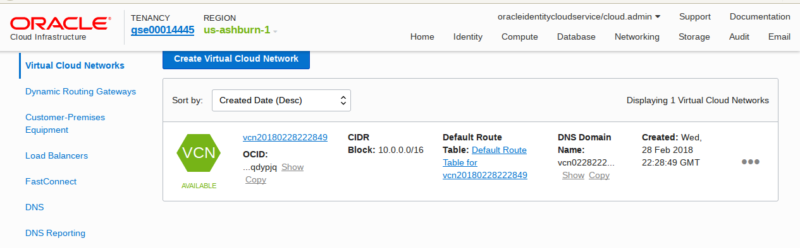

- Create a new VNC.  Note you will need to supply an additional parameter - cidr-block.  We can copy that from the previous command.

  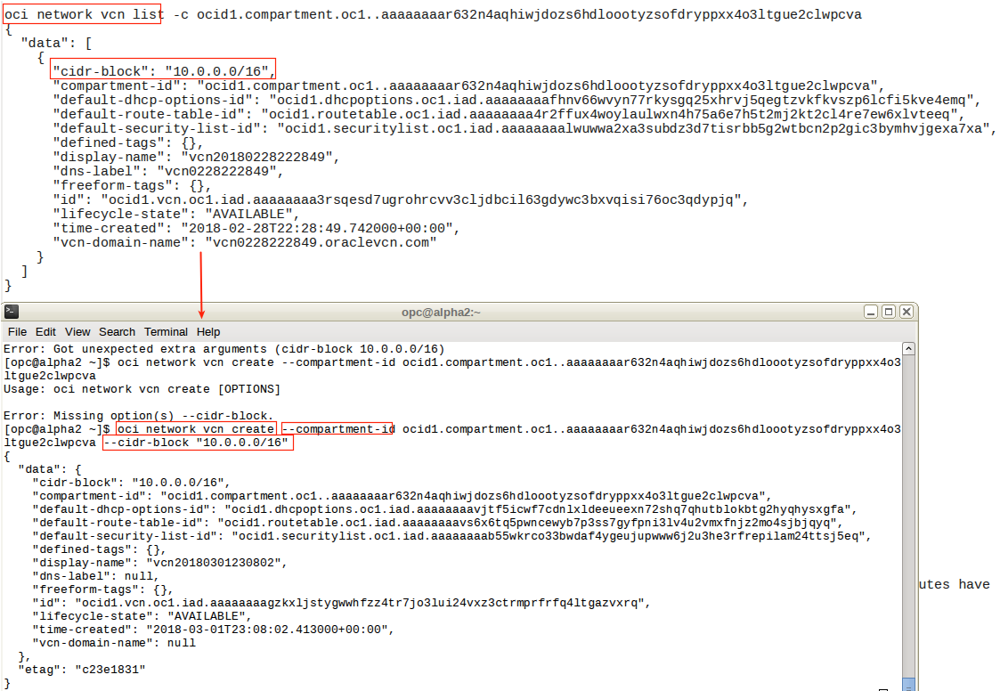

- Go back to the Cloud Console and confirm the VCN was created.

  

### **STEP 7**: Upload Files to Object Storage

- Change permissions of alpha.dmp file in /tmp/ws so opc can read and upload it
```
sudo su - oracle
chmod a+r /tmp/ws/oci_ws_alpha.dmp
exit
```
- Upload alpha.dmp to object storage.  We can multi-thread the upload.
```
oci os object put -ns <identity domain name> -bn alpha --file /tmp/ws/oci_ws_alpha.dmp --name oci_ws_alpha.dmp --part-size 10 --parallel-upload-count 10 --bucket-name=alpha
```
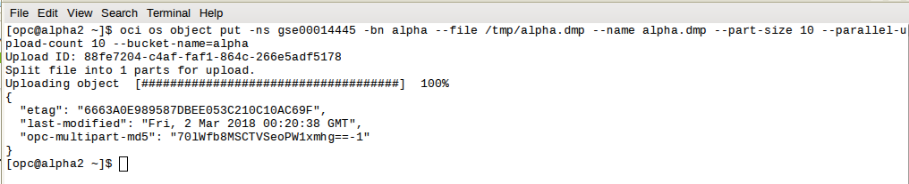

- Confirm the file was uploaded.  Navigate to Object Storage and review the alpha bucket (menu Storage - Object Storage).

  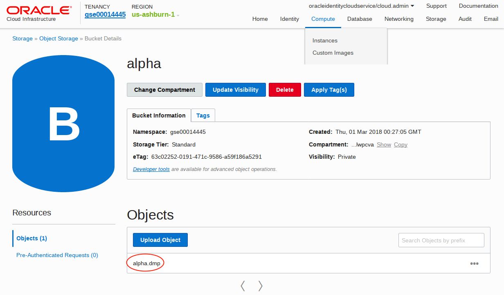