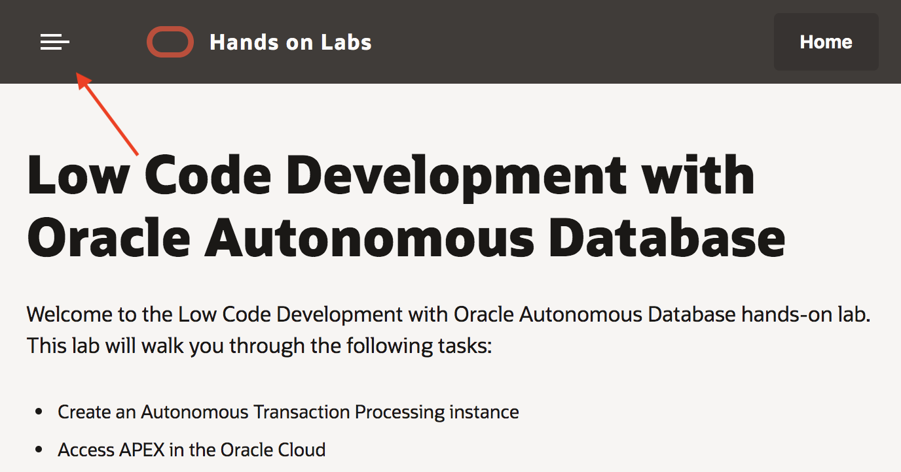
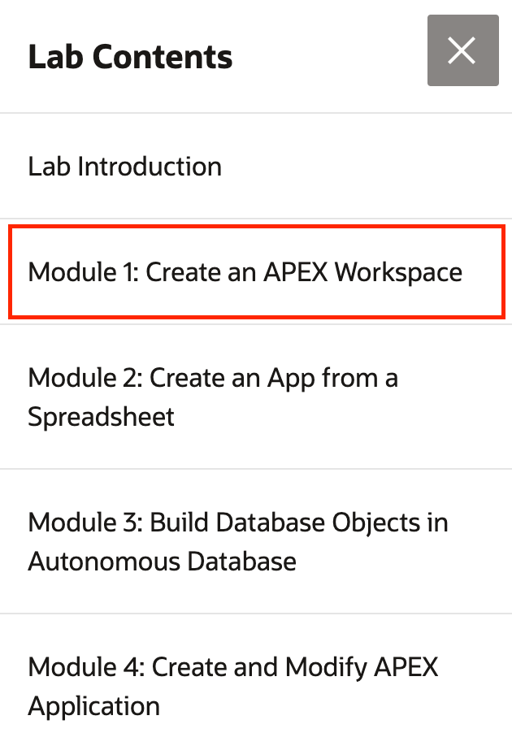

## Parts

Welcome to the Oracle Database Cloud Service Workshop. This particular version is based on Oracle's 'OCI' services, versus Oracle 'Classic' services. These labs will give you a basic understanding of the Oracle Database Cloud Service and many of the capabilities around administration and database management. Lab 100 will introduce you to DBCS and show you how to create a Cloud Database. Lab 200 will cover various data migration use cases, including pluggable database migration, tablespace migration, schema migration, and ad-hoc table copying between databases. Lab 300 covers some common Database management activities. Lab 400 show you how to use the Oracle Command Line Interface (CLI) commands to perform various tasks.  This workshop was built on and for version 19c of the database.

### **Part 1**: Acquire an Oracle Cloud trial account

1. If you already have an Oracle Cloud trial account, you may skip to the next part.

2. Please <a href="https://myservices.us.oraclecloud.com/mycloud/signup?language=en&sourceType=:ow:lp:cpo::RC_NAMK190523P00161:APEX_ATP_HOL&intcmp=:ow:lp:cpo::RC_NAMK190523P00161:APEX_ATP_HOL" target="_trial_">click this link to create your free account</a>. When you complete the registration process you'll receive an account with a $300 credit that will enable you to complete the lab for free. You can then use any remaining credit to continue to explore the Oracle Cloud.

3. Soon after requesting your trial you will receive the following email. Once you receive this email you can proceed to Part 2.

   

### **Part 2**: Navigate to Module 1

1. [Click here](1-100.md) to navigate to Module 1. Alternatively, you can click the navigation menu icon in the upper-left corner of the browser window to see a list of modules in the lab.

	 

2. Click **Module 1: Introduction and Workshop Setup**.
  
   