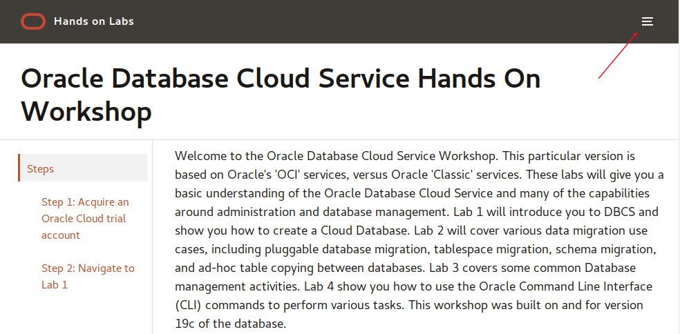

# Database Cloud Services Workshop for Oracle Compute Infrastructure (OCI)

Welcome to the Oracle Database Cloud Service Workshop. This particular version is based on Oracle's 'OCI' services, versus Oracle 'Classic' services. These labs will give you a basic understanding of the Oracle Database Cloud Service and many of the capabilities around administration and database management. Lab 100 will introduce you to DBCS and show you how to create a Cloud Database. Lab 200 will cover various data migration use cases, including pluggable database migration, tablespace migration, schema migration, and ad-hoc table copying between databases. Lab 300 covers some common Database management activities. Lab 400 show you how to use the Oracle Command Line Interface (CLI) commands to perform various tasks.  This workshop was built on and for version 19c of the database.

# Acquire an Oracle Cloud Free Tier Account or Workshop Account

If you already have an account or an active trial/free tier account, you may skip this section.  If not, you will be creating all required infrastructure components within your Oracle Cloud Free Tier account.

- Bookmark this page for future reference.

## Sign Up for a Free Tier Account

- Open up a browser and navigate to www.oracle.com. Click the **Oracle Cloud Free Tier** button in the upper right hand corner.

    

- Click on the **Start for Free** button

    

- Follow the instructions to create your account.  Be sure to enter an email you can access.  

  

- Once you complete the signup, you will receive the **Your Cloud Account is fully provisioned** Email, make note of your **Username and Cloud Account Name**.   *Note: `Usernames are usually your email address.`*  You can login by clicking the Sign In button or access it from any browser.

    

## Login to Oracle Cloud Account

- From any browser go to oracle.com to access the Oracle Cloud.

    [https://www.oracle.com/](https://www.oracle.com/)

    

- Click the icon in the upper right corner.  Click on **Sign in to Cloud** at the bottom of the drop down.  *NOTE:  Do NOT click the Sign-In button, this will take you to Single Sign-On, not the Oracle Cloud*

        

- Enter your **Cloud Account Name** in the input field and click the **My Services** button. If you have a Free Tier account provisioned, this can be found in your welcome email. Otherwise, this will be supplied by your workshop instructor.

      

- Enter your **Username** and **Password** in the input fields and click **Sign In**.

     

  **NOTE**: You will likely be prompted to change the temporary password listed in the welcome email. In that case, enter the new password in the password field.

## Navigate to Lab 100

- Once the setup is complete you can move on to lab 100 by clicking on the Menu Icon in the upper left corner of the browser window. You're now ready to continue with Lab 100.

  

### **Part 2**: Navigate to Module 1

1. [Click here](1-create-an-apex-workspace.md) to navigate to Module 1. Alternatively, you can click the navigation menu icon in the upper-left corner of the browser window to see a list of modules in the lab.

	 

2. Click **Module 1: Create an APEX Workspace**.
  
   

