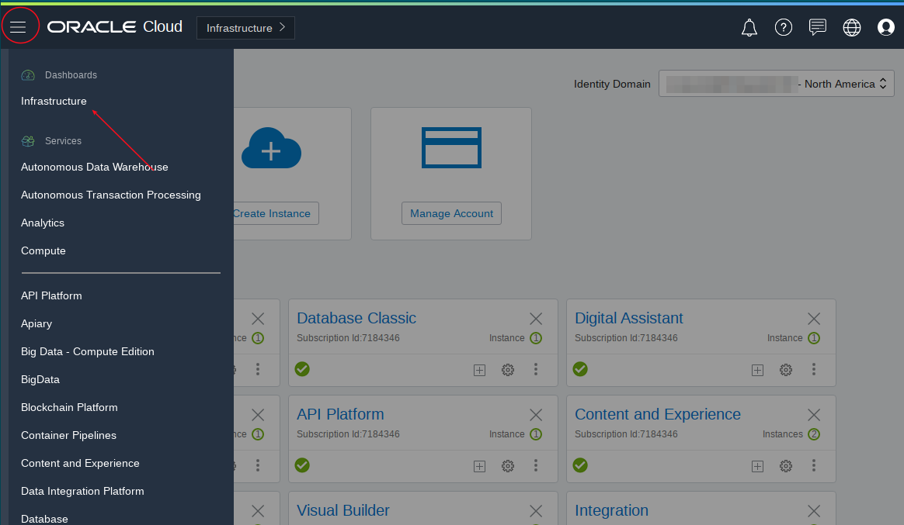

## Introduction

This is the first of four labs that are part of the Oracle Public Cloud Database Cloud Service workshop. These labs will introduce you to the Oracle Cloud and give you a basic understanding of the Oracle Database Cloud Service and many of the capabilities around administration and database development.  

This lab will walk you through creating a virtual cloud network, a new Marketplace Developer Image, and a Database Cloud Service.  You will then connect into the Marketplace image using the ssh private key to perform steps to import data into DBCS.  **Note: You must be off your corporate VPN to do the labs.**

**Note:  It will be helpful to have a notepad open as a holding place to copy and paste various items throughout all the labs.** 

To log issues and view the Lab Guide source, go to the [github oracle](https://github.com/oracle/learning-library/tree/master/workshops/dbcs-dba-oci) repository.

## Objectives

-	Familiarize yourself with the Oracle Cloud Infrastructure.
-	Create a Virtual Cloud Network (VCN).
-	Create a Marketplace Developer Image.
-   Create an OCI DBCS Database.
-   Import data into DBCS.

## Required Artifacts

-   The following lab requires a VNC Viewer to connect to an Image running on Oracle's IaaS Compute Service.

## Lab Steps

### **STEP 1**:  Log into your Oracle Cloud Account and Review the Console

- Go to [the Oracle Cloud Console](https://www.oracle.com/cloud/sign-in.html)

	

	

-	Navigate to the menu in the upper left and access and access the `Infrastructure` menu.  This will take you to the **OCI** services.  Upon initial login you are in the **Classic** services.  All the services used in this workshop are OCI Services.

	

-	Return to the menu in the upper left and select `Bare Metal, VM, and Exadata`.  Note that the menu options have changed to show OCI native services (Gen 2 Cloud).

	

- Take note of the compartment (root compartment by default) and the region.  You can use the defaults for your tenancy.  In this case the labs have been developed using the `Test` compartment and the `Phonenix` region.  Compartments are very useful for segregating content developed by different development teams and users.  They can be secured and assigned permissions appropriate to those using them.  If you expect to see services but don't see them check the compartment and region - they might be in different ones.  If you create a service in the wrong compartment you can either delete it or move it.  If it is in the wrong region you will need to delete and re-create the service.  In some cases different services need to be co-located in a region.

### **STEP 2**:  Create a Virtual Cloud Network (VCN)

### **STEP 3**:  Create a Marketplace Developer Cloud Image

### **STEP 4**:  Create a Database Cloud Service Instance

### **STEP 5**:  Import Data into DBCS

-	If you do not already have a VNC Viewer, download realvnc or tightvnc from the internet and install on your computer. Run the VNC Viewer and enter the Public IP you just copied, along with appending :1. You will be prompted for a password.  If you ran the setup instructions for vnc server you would have entered this password yourself.  Obtain this from the person who ran the setup for you if it was another person.  Start your vncviewer and enter the public IP and then `:1`.

This completes Lab 100.  You can proceed to Lab 200.